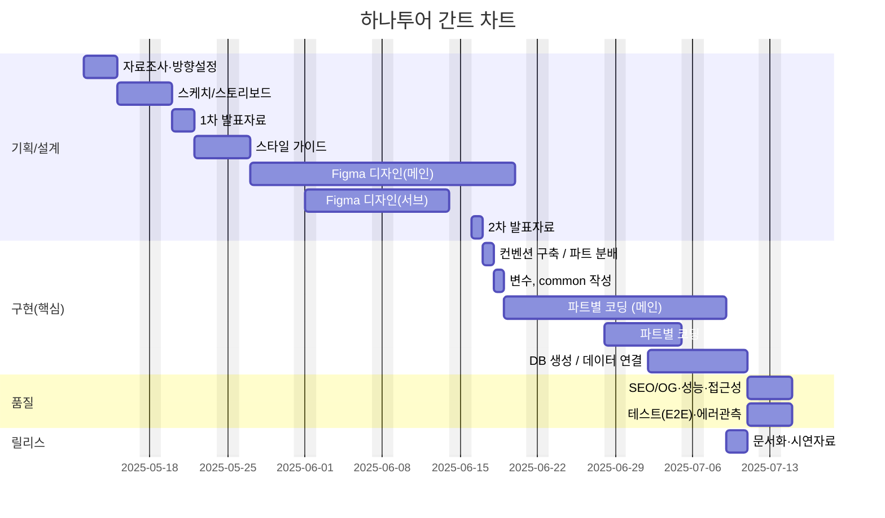
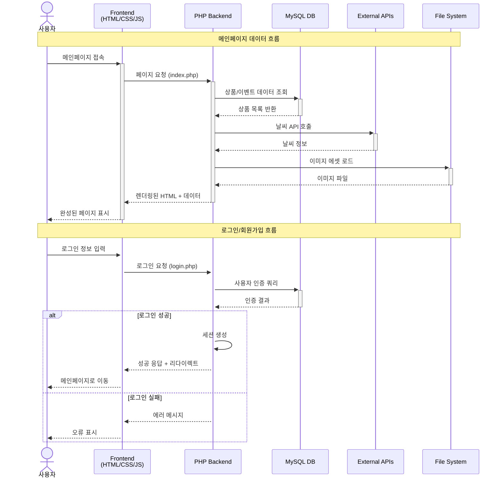
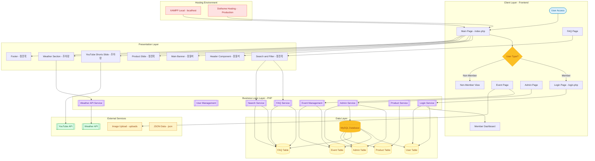

# Minimal Portfolio (2차 프로젝트)
- 과정명: 프로젝트기반 프론트엔드 개발자 양성
- 기간: 2025/03/24 ~ 2025/09/19
- 2차 프로젝트: 2025-05-12 ~ 2025-07-14

---

## 🔗 빠른 링크
 💡 **팁**: 외부 링크를 새 탭에서 열려면 `Ctrl+클릭` (Windows/Linux) 또는 `Cmd+클릭` (Mac)을 사용하세요.
 
- 📑 [기획서(피그마 슬라이드)](https://www.figma.com/design/frdj3RVv4YaQB0MXHrSj0V/2%EC%B0%A8-%ED%94%84%EB%A1%9C%EC%A0%9D%ED%8A%B8_design?node-id=1-3&t=bPGnOCQ79In0j33j-1)

- 🎨 [디자인 원본(피그마)](https://www.figma.com/slides/HtA3UUvRiurlZiIL4hyUQ3/2%EC%B0%A8-%ED%94%84%EB%A1%9C%EC%A0%9D%ED%8A%B8?node-id=53-34&t=oAqugnKRPfT7apW6-1)

---

# HanaTour 사이트 리뉴얼 프로젝트

> 기존 하나투어 웹사이트를 사용자 중심으로 디자인하고, **프론트엔드 + 백엔드**가 연동되는 **반응형 웹**으로 구현한 프로젝트입니다.

---

## 📑 목차
- [프로젝트 개요](#프로젝트-개요)
- [기술 스택](#기술-스택)
- [데이터 흐름](#데이터-흐름)
- [폴더 구조](#폴더-구조)
- [아키텍쳐](#아키텍쳐)
- [개발 환경 & 실행 방법](#개발-환경--실행-방법)
- [배포 환경](#배포-환경)
- [향후 개선 사항](#향후-개선-사항)
- [제작 후기](#제작-후기)
- [미리 보기](#미리-보기)
- [크레딧 & 버전](#크레딧--버전)

---

## 1. 프로젝트 개요
HanaTour 기존 사이트는 반응형 설계와 동적 요소가 부족했어요.  
그래서 **UX 중심 리뉴얼**, **일관된 디자인 시스템**, **반응형 레이아웃(모바일/태블릿 대응)**, **현대 웹 기술 도입(HTML5, CSS3, JS, PHP, MySQL 등)**을 목표로 프로젝트를 진행했습니다.  
디자인은 **Figma**로, 개발과 테스트는 **VS Code + XAMPP** 환경에서 이루어졌습니다.

---
### 1.1 👥 팀원
| 이름 | 역할 | 주요 담당 | GitHub | 연락 |
| --- | --- | --- | --- | --- |
| 조아랑 | 팀장 · BE 리드 | 	Weather API<br>Section Slide<br>Login Page<br>서브페이지 DB 연동<br>백엔드 구축 | [@likerang](https://github.com/likerang) | like_rang@naver.com |
| 장원석 | FE 리드 · BE | Main Section<br>반응형<br>Event Page<br>서브페이지 DB 연동<br>백엔드 구축 | [@timcho19](https://github.com/timcho19) | timcho4589@gmail.com |
| 정진욱 | FE | 	Footer<br>Section Slide<br>FAQ Page | - | - |


---

### 1.2 🗓️ 마일스톤


#### 1-4주차 — 기획/설계
- [ ] 리뉴얼 사이트 선정 및 분석
- [ ] 벤치마킹 사이트 조사
- [ ] 리뉴얼 방향 설정
- [ ] 사이트맵 구조도 제작
- [ ] 웹사이트 스케치/스토리보드 작성
- [ ] 메인 비주얼/컨셉 작업
- [ ] 스타일 가이드 및 UI 컴포넌트 제작

#### 5-8주차 — 핵심 기능
- [ ] 메인 페이지 및 서브페이지 화면 구성
- [ ] 로그인 페이지 및 인증 기능 구현
- [ ] DB 연동 및 CRUD 기능 개발
- [ ] 이미지 업로드 및 썸네일 처리

#### 9주차 — 품질 점검 및 배포 준비
- [ ] SEO, OG 태그 설정 및 사이트맵 작성
- [ ] 성능 최적화 및 코드 스플리팅 적용
- [ ] 접근성 점검(키보드 포커스/명도 대비 등)
- [ ] 닷홈으로 배포
- [ ] README, 시연자료(스크린샷·GIF) 정리




---

### 1.3 주요 기능 & 페이지 구성
- **메인 페이지**
  - 헤더, 메인 배너 (장원석 담당)
  - 상품 슬라이드, 푸터 (정진욱 담당)
  - Shorts/Youtube 슬라이드, 날씨 API 통합 (조아랑 담당)
- **FAQ 페이지**
  - 검색창, 카테고리 필터 (정진욱 담당)
- **로그인/회원가입 페이지**
  - 비회원 조회 기능, DB 연동 (조아랑 담당)
- **이벤트 & 관리자 페이지**
  - 이벤트 콘텐츠 및 관리자 기능 (장원석 담당)

---


## 2. 개발 환경
- **Design**: Figma  
- **Frontend**: HTML5, CSS3, JavaScript, jQuery  
- **Backend**: PHP, MySQL  
- **개발 도구**: VS Code, XAMPP  

## 2.1 📚 개발 컨벤션 가이드
프로젝트에서 사용하는 HTML, CSS, JavaScript 작성 규칙은 아래 문서를 참고하세요.

- [HTML 컨벤션](./docs/guide_html.md)
- [CSS 컨벤션](./docs/guide_css.md)
- [JavaScript 컨벤션](./docs/guide_js.md)

---

## 3. 데이터 흐름



---

## 4. 폴더 구조
```
/
├─ .vscode/
├─ css/              # 스타일 시트
├─ image/            # 이미지 에셋
├─ inc/              # 공통 include 모듈
├─ js/               # JavaScript 코드
├─ json/             # JSON 데이터
├─ sql/              # DB 스크립트
├─ uploads/          # 업로드 파일
├─ view/             # 뷰 템플릿
├─ *.php             # 주요 페이지 (index.php, login.php 등)
└─ readMe.md         # 기존 README
```

---

## 5. 아키텍쳐 


---

## 6. 개발 환경 & 실행 방법
1. **클론**
   ```bash
   git clone https://github.com/likerang/Site_Renewal_Project_HanaTour.git
   cd Site_Renewal_Project_HanaTour
   ```
2. **XAMPP 연결**
   - 프로젝트 폴더를 `htdocs/` 안에 복사
   - **MySQL** 실행, DB 세팅 (`sql/` 폴더 참고)

3. **웹 브라우저로 접근**
   - 로킬 : `http://localhost/Site_Renewal_Project_HanaTour` 접속
   - 배포링크: [닷홈 링크](http://timcho4589.dothome.co.kr/hanatour_renewal/)

4. **관리자 계정**
   - ID: `admin`
   - PW: `admin123`

---

## 7. 배포 환경
- **호스팅**: Dothome  
- **배포 URL**: [http://timcho4589.dothome.co.kr/hanatour_renewal/](http://timcho4589.dothome.co.kr/hanatour_renewal/)  
- **배포 방식**: FTP 업로드 (FileZilla 등)

---

## 8. 향후 개선 사항
- 반응형 개선: 모바일/태블릿 최적화 강화
- 맞춤형 콘텐츠 강화
- 접근성 향상: ARIA, 키보드 내비게이션, 명도 대비 체크

---

## 9. 제작 후기
이번 프로젝트를 통해 PHP와 데이터베이스 연동을 활용한 동적 웹사이트 구현을 성공적으로 완료하였으며, 팀원들과의 원활한 협업 경험도 쌓을 수 있었습니다.
전반적으로 기획부터 개발까지 웹 개발의 전 과정을 경험하며 많은 성장을 이룬 의미있는 프로젝트였습니다.

---

## 10. 미리보기
[](https://www.figma.com/design/frdj3RVv4YaQB0MXHrSj0V/2%EC%B0%A8-%ED%94%84%EB%A1%9C%EC%A0%9D%ED%8A%B8_design?node-id=1-3&t=bPGnOCQ79In0j33j-1 "피그마 슬라이드로 이동")
[](https://www.figma.com/slides/HtA3UUvRiurlZiIL4hyUQ3/2%EC%B0%A8-%ED%94%84%EB%A1%9C%EC%A0%9D%ED%8A%B8?node-id=53-34&t=oAqugnKRPfT7apW6-1 "피그마 디자인으로 이동")


## 10.1 크레딧 & 버전
- 디자인: Figma  
- 개발: 조아랑, 정진욱, 장원석  
- 작업 기간: *2025-05-12 ~ 2025-07-14*
