# 과정명 : 프로젝트 기반 프론트엔드 개발자 양성
- 기간:2025/03/04 ~ 2025/09/24
- 2차프로젝트 :2025/04/07 ~ 2025/05/07

# 하나투어 사이트 리뉴얼 - PHP 기반(2차프로젝트)

## 🔗 빠른 링크
- 📑 기획서(피그마 슬라이드): [2차프로젝트 ppt](https://www.figma.com/slides/HtA3UUvRiurlZiIL4hyUQ3/2%EC%B0%A8-%ED%94%84%EB%A1%9C%EC%A0%9D%ED%8A%B8?node-id=53-34&t=i6jgyabhooAPbh1l-1)
- 🎨 디자인 시안(피그마): [https://www.figma.com/file/hanatour-renewal-design](https://www.figma.com/file/hanatour-renewal-design)

---

## 1. 프로젝트 개요

### 1.1 목표
- **사용자 경험 개선**: 기존 하나투어 사이트의 UI/UX를 현대적으로 재구성
- **동적 콘텐츠 관리**: PHP + MySQL 기반으로 여행상품, 게시글, 이벤트 등을 DB에서 불러와 출력
- **관리자 페이지 구현**: 상품·게시글 CRUD 가능
- **반응형 설계**: 모바일·태블릿·데스크톱 대응
- **실서비스 운영 고려**: 호스팅 환경에서 배포 테스트

### 1.2 👥 팀원

| 이름 | 역할 | 주요 담당 | GitHub | 연락 |
| --- | --- | --- | --- | --- |
| 장원석 | 팀장 · 풀스택 | DB 설계·연동, 상품/게시글 CRUD, 서버 배포 | [@timcho19](https://github.com/timcho19) | example@email.com |
| 김예시 | 디자인 | 피그마 UI 제작, 반응형 시안 디자인 | [@design-kim](https://github.com/design-kim) | design@email.com |
| 박예시 | 프론트엔드 | HTML/CSS/JS 퍼블리싱, 메인페이지·상품 상세 UI 구현 | [@front-park](https://github.com/front-park) | front@email.com |

---

## 2. 마일스톤

#### 간트차트

```mermaid
gantt
    title 하나투어 리뉴얼 간트차트
    dateFormat  YYYY-MM-DD
    excludes    weekends


    section 기획/설계
    자료조사·방향설정           :a1, 2025-05-12, 4d
    스케치/스토리보드           :a2, after a1, 4d
    기획발표                   :a3, after a2, 1d
    스타일 가이드              :a4, after a3, 3d
    Figma 와이어프레임·디자인        :a5, after a4, 14d


    section 구현(핵심)
    컨벤션 구축 / 파트 분배     :b1, 2025-06-17, 2d
    파트별 코딩           :b2, after b1, 16d


    section 품질
    SEO/OG·성능·접근성         :c1, 2025-07-11, 2d
    테스트(E2E)·에러관측       :c2, 2025-07-11, 2d

    section 릴리스
    문서화·시연자료 :d1, 2025-07-14, 1d
```

---

## 3. 주요 기능

#### 👤 사용자 기능
- 회원가입, 로그인, 로그아웃
- 여행상품 목록·상세 보기
- 게시판/이벤트 보기
- 예약 신청(폼 전송)

#### 🛠 관리자 기능
- 로그인 후 상품/게시글 등록·수정·삭제
- 업로드 이미지 관리
- DB 기반 콘텐츠 관리

#### 📂 부가 기능
- 카테고리별 필터
- 검색 기능
- 페이지네이션

---

## 4. 개발 환경

- **Frontend**: HTML5, CSS3, JavaScript(jQuery)
- **Backend**: PHP 8.x
- **Database**: MySQL 8.x
- **서버환경**: Apache (XAMPP/호스팅 서버)
- **버전관리**: Git & GitHub
- **디자인**: Figma

---

## 5. 페이지 라우팅 구조

| 경로                 | 설명                      | 접근 권한 |
|----------------------|---------------------------|-----------|
| `/`                  | 메인 홈                   | 전체      |
| `/product/list.php`  | 여행상품 목록              | 전체      |
| `/product/view.php`  | 여행상품 상세              | 전체      |
| `/board/list.php`    | 게시판 목록                | 전체      |
| `/board/view.php`    | 게시글 상세                | 전체      |
| `/member/login.php`  | 로그인                     | 비로그인  |
| `/member/join.php`   | 회원가입                   | 비로그인  |
| `/admin/index.php`   | 관리자 대시보드            | 관리자    |
| `/admin/product_*`   | 상품 등록/수정/삭제        | 관리자    |

---

## 6. DB 구조(개선된 ERD)

```mermaid
erDiagram
    MEMBER {
        int member_id PK "회원 고유 ID"
        varchar name "회원 이름"
        varchar email "이메일 (Unique)"
        varchar password "비밀번호 (Hash)"
        varchar role "권한 (user/admin)"
        datetime reg_date "가입일"
    }
    PRODUCT {
        int product_id PK "상품 고유 ID"
        varchar title "상품명"
        text description "상품 설명"
        decimal price "가격"
        varchar image "대표 이미지 경로"
        datetime reg_date "등록일"
    }
    BOARD {
        int board_id PK "게시글 고유 ID"
        varchar title "게시글 제목"
        text content "게시글 내용"
        int member_id FK "작성자"
        datetime reg_date "작성일"
    }
    RESERVATION {
        int reserve_id PK "예약 고유 ID"
        int member_id FK "예약자"
        int product_id FK "상품"
        datetime reserve_date "예약일"
        varchar status "예약 상태"
    }

    MEMBER ||--o{ BOARD : writes
    MEMBER ||--o{ RESERVATION : makes
    PRODUCT ||--o{ RESERVATION : includes
```



---

## 7. 실행 방법

1. **클론**
```bash
git clone https://github.com/timcho19/Site_Renewal_Project_HanaTour.git
cd Site_Renewal_Project_HanaTour
```
2. **DB 설정**
   - `db/config.php`에 MySQL 접속 정보 입력
   - `/db/hnt_schema.sql`을 MySQL에 Import
3. **서버 실행**
   - 로컬: XAMPP/MAMP 등 Apache + PHP 실행
   - 웹 브라우저에서 `http://localhost/Site_Renewal_Project_HanaTour` 접속
4. **관리자 계정**
   - ID: `admin`
   - PW: `admin123`

---

## 8. 제작 후기
이 프로젝트를 통해 PHP와 MySQL을 활용한 서버사이드 렌더링 방식 웹 개발을 경험했고,  
여행상품·게시글 CRUD, 관리자 페이지, 반응형 UI 등 실무형 기능을 구현하였습니다.  
특히 DB 설계와 보안(세션, SQL Injection 방지) 부분에서 많은 학습이 있었습니다.

---

## 9. 기획/디자인 문서
- **기획서(피그마 슬라이드)**: [https://www.figma.com/file/hanatour-renewal-plan](https://www.figma.com/file/hanatour-renewal-plan)
- **디자인 시안(피그마)**: [https://www.figma.com/file/hanatour-renewal-design](https://www.figma.com/file/hanatour-renewal-design)
